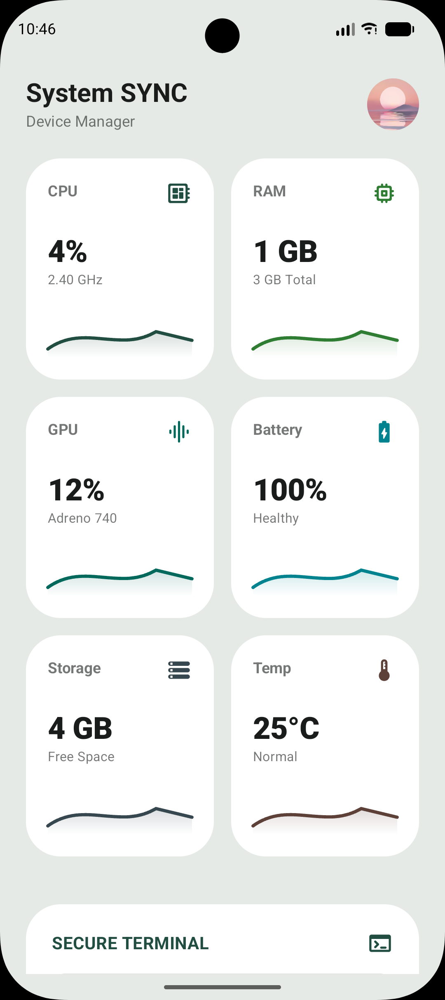
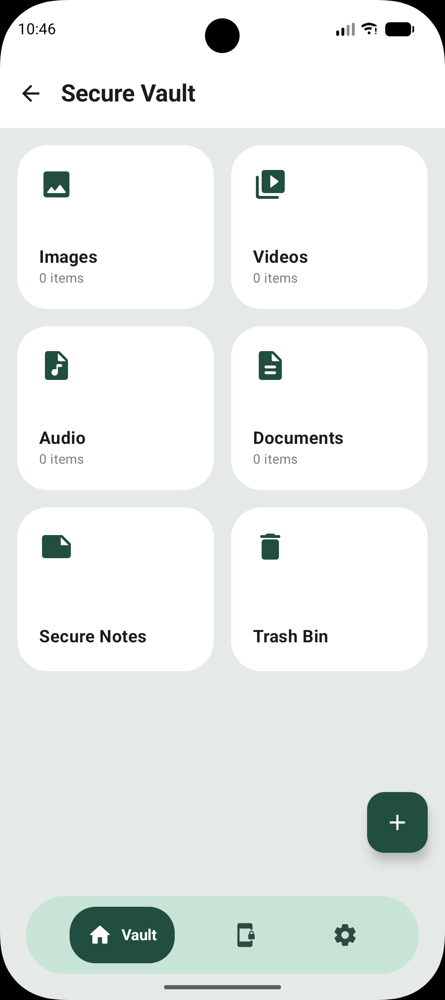
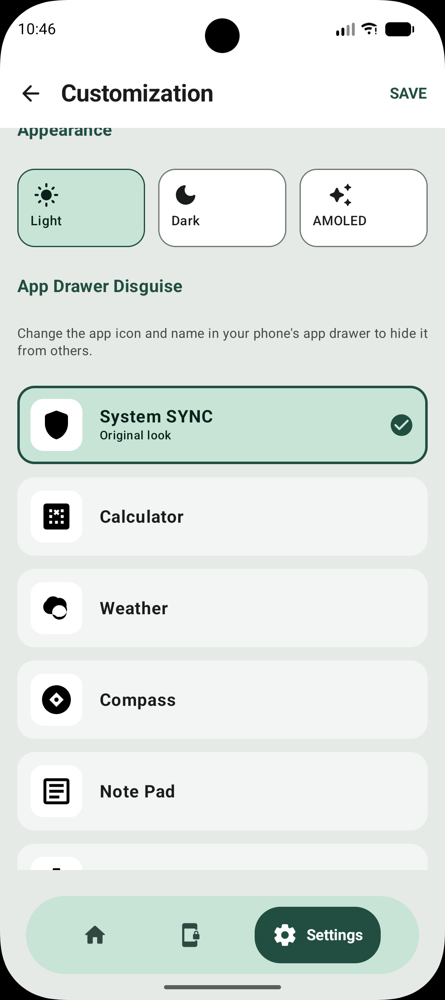
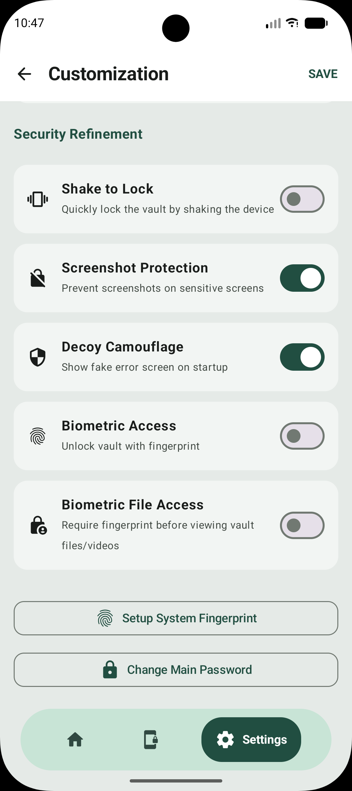
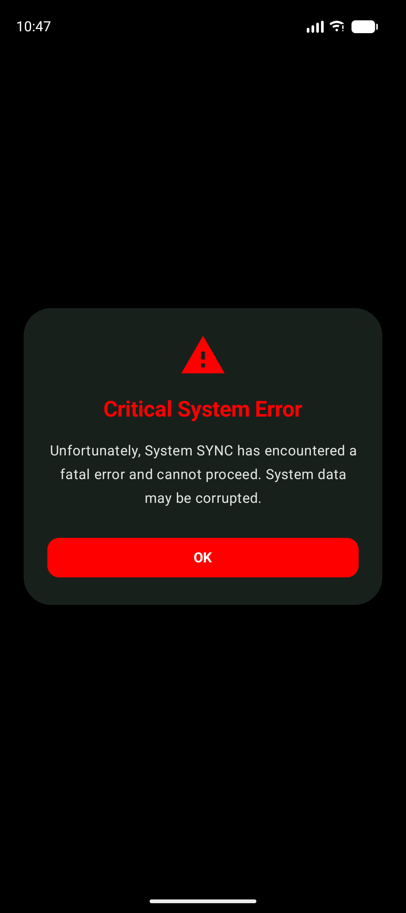

# 🛡️ System SYNC

> **Advanced Local Device Manager & Secure Privacy Vault**  
> *Built with Jetpack Compose, Material 3 Expressive (Material You), and a modern Sage & Mint aesthetic.*

---

## 📱 About System SYNC

**System SYNC** is a professional-grade Android application combining real-time hardware monitoring with a military-grade local privacy vault. Designed with a clean, modern **Material 3 Expressive** design system (featuring a soothing pastel sage and mint green palette), System SYNC keeps your device data transparent and your private files strictly confidential.

---

## ✨ Key Features

### 📊 1. Hardware Dashboard
- Real-time monitoring of **CPU usage, RAM allocation, GPU status, Battery health & temperature, and Storage capacity**.
- Smooth animated status graphs for quick hardware diagnostics.
- Secure terminal interface for advanced system interactions.

### 🗄️ 2. Encrypted Secure Vault
- Securely hide and store **Photos, Videos, Audio, and Documents**.
- **Secure Notes**: Encrypted note-taking space inside the vault.
- **Trash Bin**: Recover or permanently delete deleted vault items.
- **Biometric File Protection**: Optional secondary fingerprint verification required before opening any vault file or video.

### 🎭 3. App Drawer Disguise (Stealth Camouflage)
- Change the app icon and name in your phone's app launcher to blend in seamlessly.
- Pre-built disguise personas: **Calculator, Weather, Compass, Note Pad, and System Settings**.

### 🚨 4. Stealth Mode (Decoy Camouflage)
- Option to display a convincing **"Critical System Error"** fake crash screen on startup or when launching protected apps to deter snoopers.

### 🎨 5. Material 3 Expressive UI
- Soothing pastel sage background (`#E5EAE7`) paired with pure clean white rounded container cards (`28.dp`).
- Deep forest teal-green primary accents (`#214E41`) and pastel mint highlights (`#C8E4D6`).
- Live settings preview with instant UI updates and safe "SAVE / Revert on Discard" workflows.

---

## 📸 Screenshots

| Dashboard / System Monitor | Secure Vault |
| :---: | :---: |
|  |  |

| Customization & Disguise | Security & Legal |
| :---: | :---: |
|  |  |

| Decoy Camouflage (Stealth Mode) |
| :---: |
|  |

---

## 🛠️ Tech Stack & Architecture

- **Language**: Kotlin 2.2+
- **UI Framework**: Jetpack Compose & Material 3 (M3 Expressive)
- **Architecture**: MVVM (Model-View-ViewModel) with Kotlin Coroutines & StateFlow
- **Local Storage**: Jetpack DataStore (Preferences) & Room Database
- **Security**: Android BiometricPrompt & Local AES-256 Encryption

---

## 🚀 Getting Started

1. Clone the repository:
   ```bash
   git clone https://github.com/your-username/system-sync.git
   ```
2. Open the project in **Android Studio** (Koala / Jellyfish or newer).
3. Sync Gradle and run the app on an Android device or emulator (API 28+).

---

## 📄 License

This project is licensed under the **MIT License** - see the [LICENSE](LICENSE) file for details.

---
*Built with privacy and modern design in mind.*
